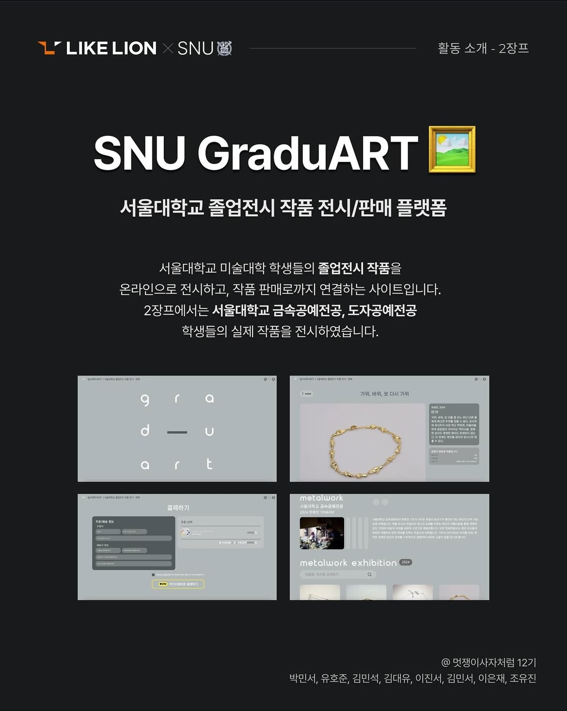
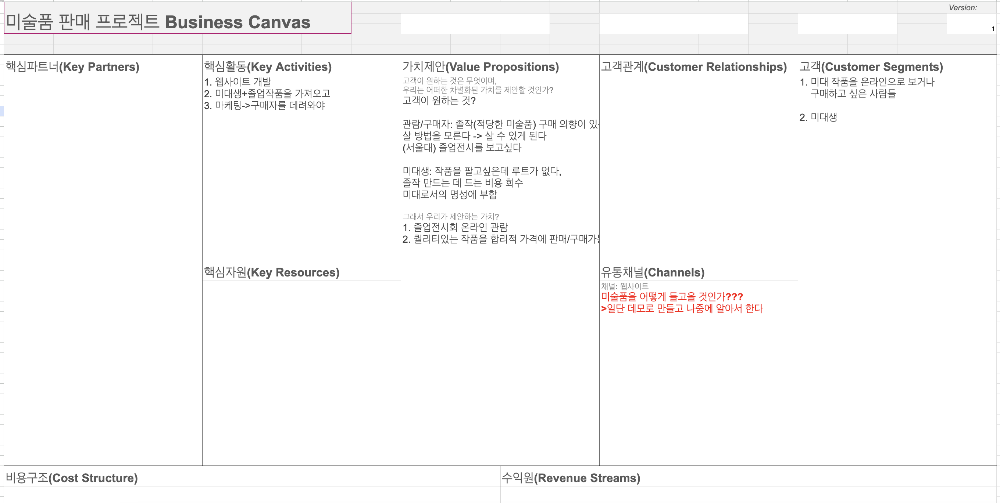
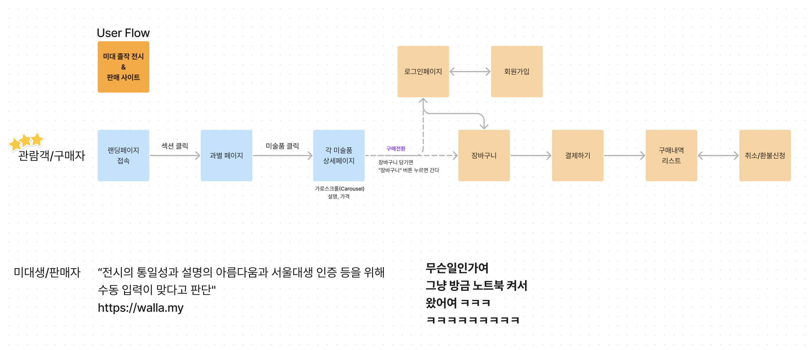
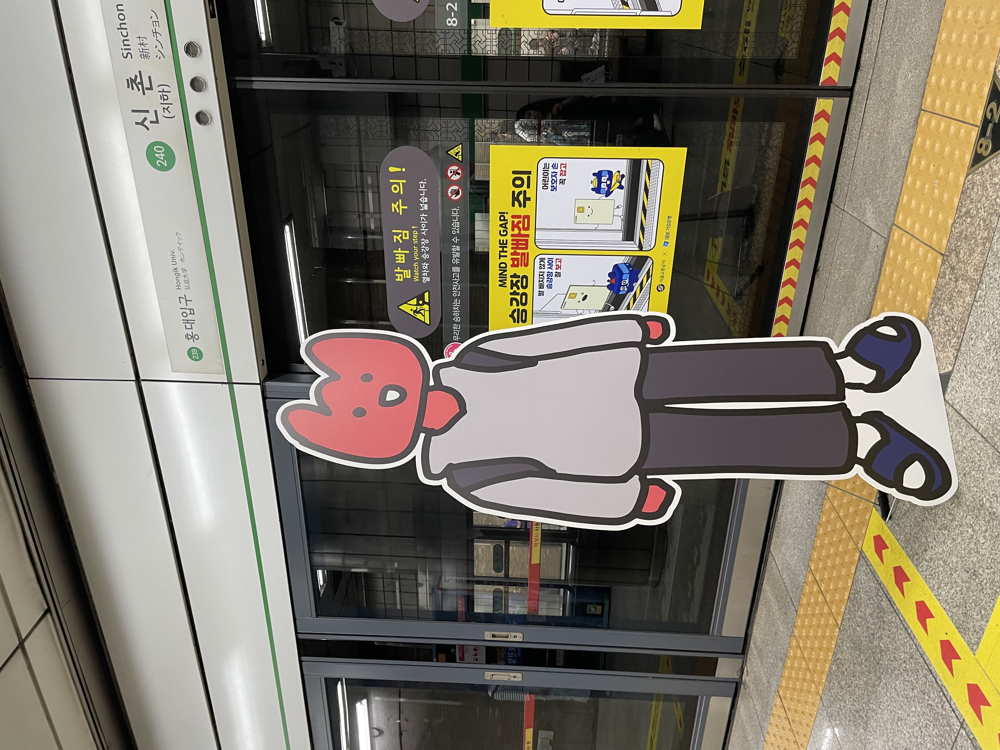

# 📖 GraduART README

### [배포 URL](https://graduart.gallery)

## 개발 시 주의사항

### [👉 개발 규칙 링크](README/DevRule.md)

## 개발 컨벤션

### [👉 개발 컨벤션 링크](README/codeConvention.md)

 

## 프로젝트 소개

서울대학교 미술대학 학우분들을 위한 작품 전시 및 판매 서비스

## 프로젝트 개발 과정

### 1. 비지니스 캔버스

### 2. Userflow

### 3. ERD / API 명세

### 👉 <a href="https://www.figma.com/board/TSTx7P0laHRFzgxdNLoN4n/%EB%AF%B8%EB%8C%80-%EC%A1%B8%EC%9E%91-%ED%8C%90%EB%A7%A4-%EC%82%AC%EC%9D%B4%ED%8A%B8?node-id=0-1&t=ZUhwNUFAk1RXNUBh-0">피그잼 링크</a>

## 팀원 구성

|                                                   **김대유**                                                   |                                             **김민석**                                             |                                                 **박민서**                                                 |                                                 **유호준**                                                  |
| :------------------------------------------------------------------------------------------------------------: | :------------------------------------------------------------------------------------------------: | :--------------------------------------------------------------------------------------------------------: | :---------------------------------------------------------------------------------------------------------: |
| [   @Mushroombud](https://github.com/Mushroombud) | [   @minss7](https://github.com/minss7) | [   @charijyard](https://github.com/charijyard) | [   @hoooooojjjj](https://github.com/hoooooojjjj) |

 

## 개발 환경

- Front : HTML, JavaScript, React, Emotion(css)
- Back-end : Django, Supabase
- 버전 및 이슈관리 : Github
- 협업 툴 : 채널톡, Notion
- 서비스 배포 환경 : vercel,Oracle Cloud
- 디자인 : Figma

   
